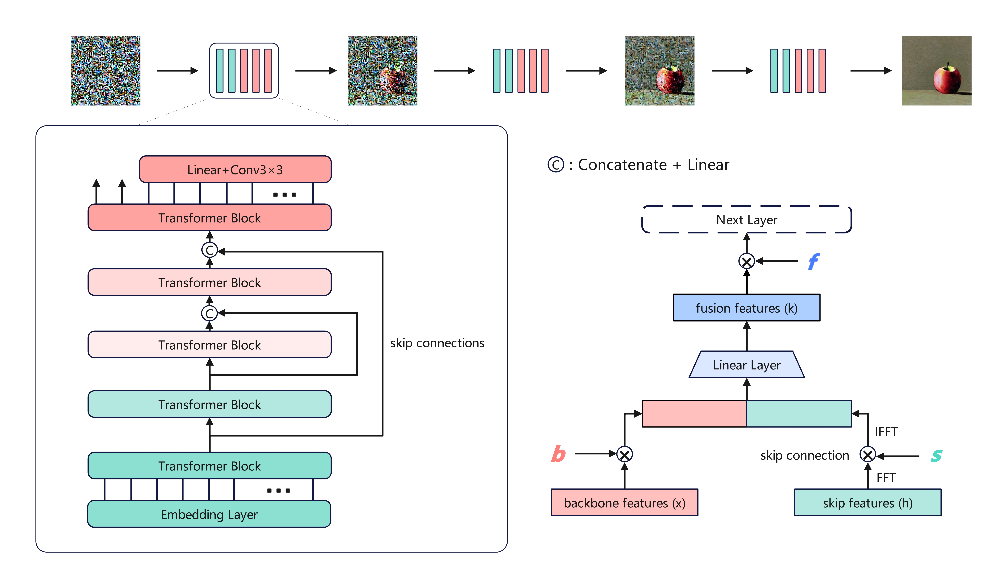

# FreeV：Zero-cost improvement approach in Diffusion U-ViT


​You can apply the FreeV method by replacing the "libs/uvit_multi_post_ln.py" file in UniDiffuser. You can also read the uvit_multi_post_ln.py code directly to easily understand our improved method (our method is as simple as FreeU and involves only a few lines of code to implement).


​It's evident that the model influenced by the FreeV improvement method exhibits a smoother process and more consistent information changes between adjacent denoising steps during the denoising process. Unlike the conventional models for non-generative tasks, where cosine similarity scores between different layers emphasize better feature extraction, and lower scores between consecutive layers indicate more information gain, in generative diffusion models, a smoother generation process signifies a more unified trend and better performance, especially when the final generated image quality remains consistent. Therefore, lower cosine similarity scores between adjacent denoising steps are considered better in generative diffusion models.

​The cosine similarity scores in the later stages of denoising with FreeV are consistently higher compared to the model before improvement. This observation explains why FreeV performs remarkably well in denoising tasks. By appropriately modulating features from skip connections and backbone networks, FreeV leads to a more unified generation trend, at least in the context of image generation tasks.


### Method



​We introduces a simple yet effective approach tailored for the U-ViT architecture,  known as '**FreeV**.' Leveraging the advantage of the unique feature fusion method within the visual Transformer architecture equipped with skip connections, FreeV significantly enhances the denoising and generation capabilities of the U-ViT architecture, substantially improving the quality of generated outputs without the need for additional training or fine-tuning.

​Initially, for the $l$-th Transformer Block, this paper denotes $x_{l}$ as the backbone feature map from the preceding Transformer Block, $h_{l}$ as the feature map from the corresponding skip connection, and $k_{l}$ as the resulting fused feature map from combining $x_{l}$ and $h_{l}$. To adjust these feature maps, three scalar factors are introduced: the backbone feature scaling factor $b_{l}$ for $x_{l}$, the skip feature modulation factor $s_{l}$ for $h_{l}$, and the fusion feature scaling factor $f_{l}$ for $k_{l}$. Experimental studies reveal that uniformly amplifying all channels of $x_{l}$ tends to produce excessively smoothed textures in the generated synthetic images. To preserve high-frequency details in the synthesized images while enhancing U-ViT denoising, this paper confines the scaling operation to half of the channels in $x_{l}$, as illustrated below:

```math
x'_{l,i} = \begin{cases}
	b_{l}*x_{l,i}, & \text{if } C/2< i < C \\
    x_{l,i}, & \text{otherwise }
\end{cases}
```

​	Where $x_{l,i}$ represents the $i$-th channel of the backbone feature map $x_{l}$. Here, $C$ denotes the total number of channels in $x_{l}$, specifically 1536 in the U-ViT framework employed in this paper. This partial channel implementation strategy not only enhances the denoising capabilities of the backbone but also avoids adverse consequences of uncontrolled global scaling. However, limitations persist in U-ViT's feature fusion process. As mentioned earlier, its fixed-parameter linear mapping restricts any alterations before the linear fusion layer and significantly limits the interpretability analysis of the model. Therefore, solely adjusting the scaling of skip features is insufficient to achieve our objective. Consequently, we perform similar adjustments on the fused features:

```math
k'_{l,i} = \begin{cases}
  f_{l}*k_{l,i}, & \text{if	} i < C/2 \\
  k_{l,i}, & \text{otherwise }
\end{cases}
```
​	Where $k_{l,i}$ represents the $i$-th channel of the fused feature map $k_{l}$. The paper enhances the first half of the channels in the fused feature map, hoping that this bold maneuver will circumvent unpredictability in the linear layer's feature mapping. The aim is to strike a delicate balance between enhancing denoising capabilities and preserving texture details.

​	The direct incorporation of features from shallow Transformer Blocks into deep-level skip connections introduces a significant amount of high-frequency information, leading us to make a choice similar to the approach in FreeU. The mathematical operation for applying the modulation factor \(s\) to skip features is executed as follows: 

```math
F(h_{l,i}) = \text{FFT}(h_{l,i}) \quad
```

```math
F'(h_{l,i}) = F(h_{l,i}) \odot \alpha_{l,i} \quad
```

```math
h'(h_{l,i}) = \text{IFFT}(F'(h_{l,i})) \quad
```

​	Where $\text{FFT}(·)$ and $\text{IFFT}(·)$ denote the Fourier Transform and Inverse Fourier Transform, respectively. $\odot$ represents element-wise multiplication. $\alpha_{l,i}$ is the mask applied to the Fourier domain to achieve suppression of Fourier low-frequency components, implemented as a function that uses the scaling factor $s_{l}$ for suppression.

```math
\alpha_{l,i}(r) = \begin{cases}
  s_{l} & \text{if	} r < r_{thresh} \\
  1 & \text{otherwise }
\end{cases}
```

​	Where $r$ represents the radius, and $r_{thresh}$ is the threshold frequency. In the code implementation, the low-frequency components are shifted to the center of the frequency domain, processed through threshold filtering, and then rescaled using $$s_{l}$$ to restore their original shape. After this stage, the features from the backbone network and skip connections, following the linear layer mapping, undergo channel-wise enhancement in the fused features. Subsequently, these features are utilized in the subsequent layers of the U-ViT architecture. It's important to note that the U-ViT structure shown in the figure is for the image generation task, differing slightly from the U-ViT structure that outputs text in a multi-modal diffusion model. However, the FreeV enhancement approach remains unchanged.


​	The actual effect, validates the effectiveness of the FreeV approach proposed in this paper within the U-ViT architecture. The augmentation by modulation factors $b$ and $f$, when applied to the channels, enriches the completeness of the semantic subject. While diminishing their impact on the channels, factor $b$ introduces smoother and blurrier views, whereas factor $f$ brings about more fragmented noise points. The adjustment factor $s$ determines the richness of image details.


